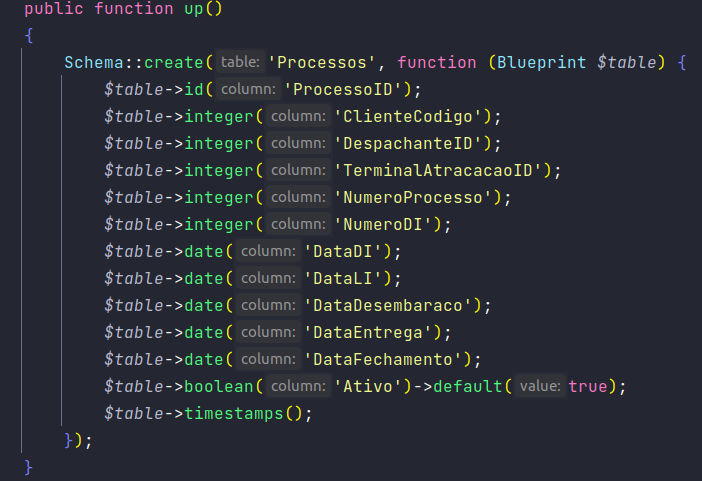
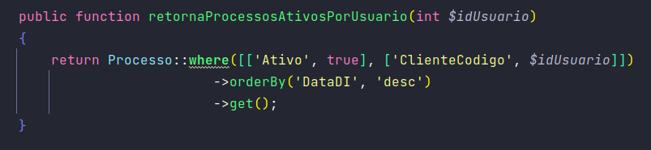
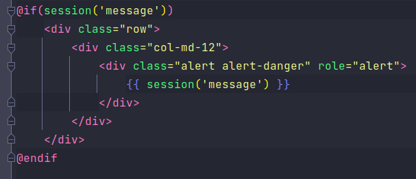
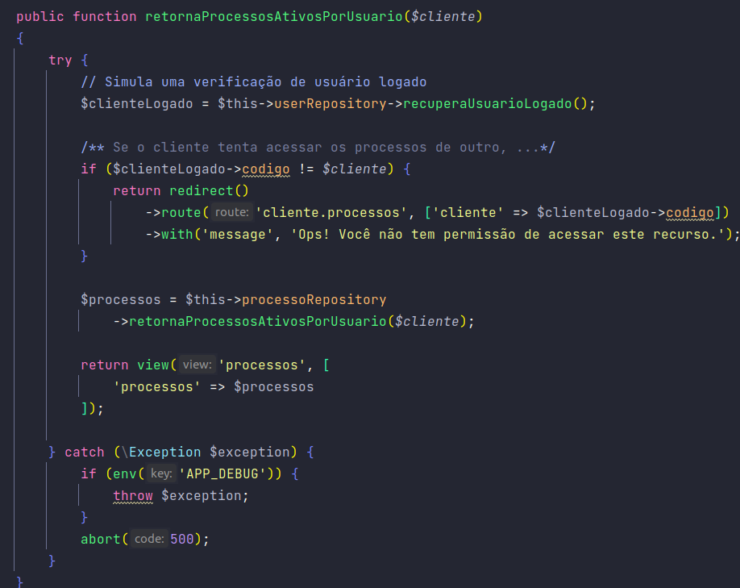

# Teste D2P

## Etapas de Criação

Primeiramente foram setadas as configurações de comunicação com o banco do arquivo **.env**

Criou-se então o arquivo de **migration** create_processos para definir a tabela de "Processos" na base de dados,
como visto no detalhe do método up a seguir:

[2022_05_26_011310_create_processos.php](database/migrations/2022_05_26_011310_create_processos.php)

Logo em seguida criou-se a **model** Processo com alguns Acessors necessários para a exibição das datas, como visto a seguir:

[Processo.php](app/Models/Processo.php)

Os **repositories** foram alocados no diretório *app/Repositories*. **ProcessoRepository**, para fins de praticidade
recebeu apenas o método necessário para se completar os requisitos do teste.

[ProcessoRepository.php](app/Repositories/ProcessoRepository.php)

>Também foi criado um arquivo de repository utilizado para simularmos o retorno de um usuário logado
>como pode ser visto em [UserRepository.php](app/Repositories/UserRepository.php)

Criou-se um arquivo de **view** simples apenas com uma *table bootstrap* para exibir as informações sobre os processos
solicitados pelo cliente e também um campo para mensagens vindas do backend, como pode ser observado no arquivo a seguir. 

[processos.blade.php](resources/views/processos.blade.php)

Foi criado também um **controller** para os processos. Todas as ações realizadas no método responsável pela exibição 
dos processos do usuário foram envolvidas por um bloco *try - catch* e os repositories injetados pelo *__construct*.
Logo no início realizamos uma busca do usuário logado  e verificamos se corresponde ao código do cliente recebido via url.
Essa verificação é feita para garantir que nenhum cliente acesse os processos de outro. Em seguida, busca-se os dados
dos processos do cliente através do repository e retorna-se uma view com estes dados. Em caso de erro será exibida uma
página padrão do laravel.

[ProcessoController.php](app/Http/Controllers/ProcessoController.php)

Por fim temos a rota criada para acesso do recurso. A rota foi colocada em um grupo de rotas para facilitar a criação de
rotas futuras. Ela também foi nomeada possibilitar sua chamada dentro do controller.

[Routes](routes/web.php)

## Sequência das possíveis visualizações do cliente

#### Página de erro ao tentar acessar recurso de outro usuário

#### Página de erro inesperado

#### Página de exibição dos processos do cliente

